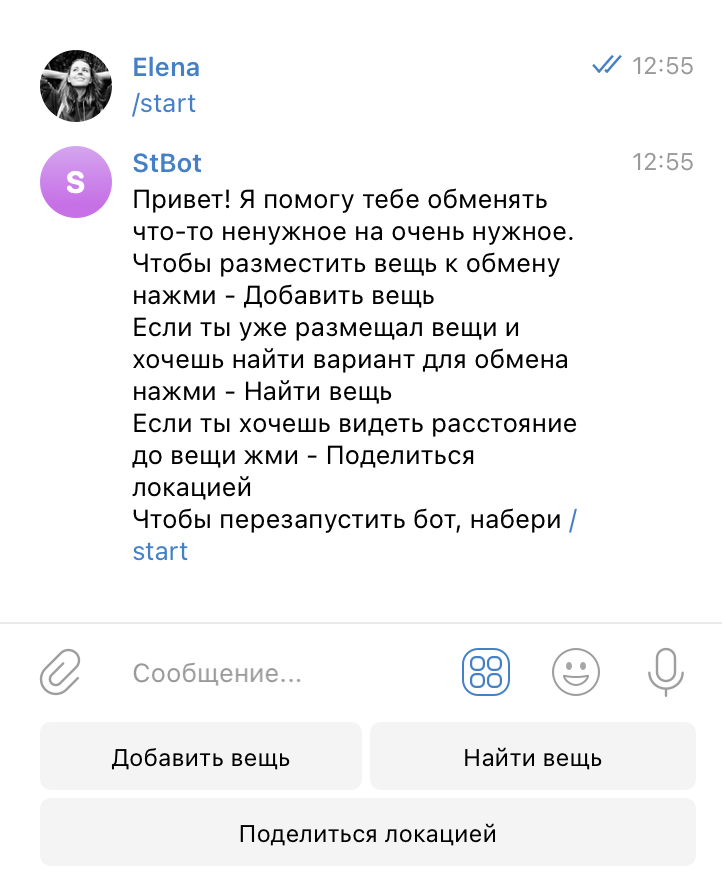
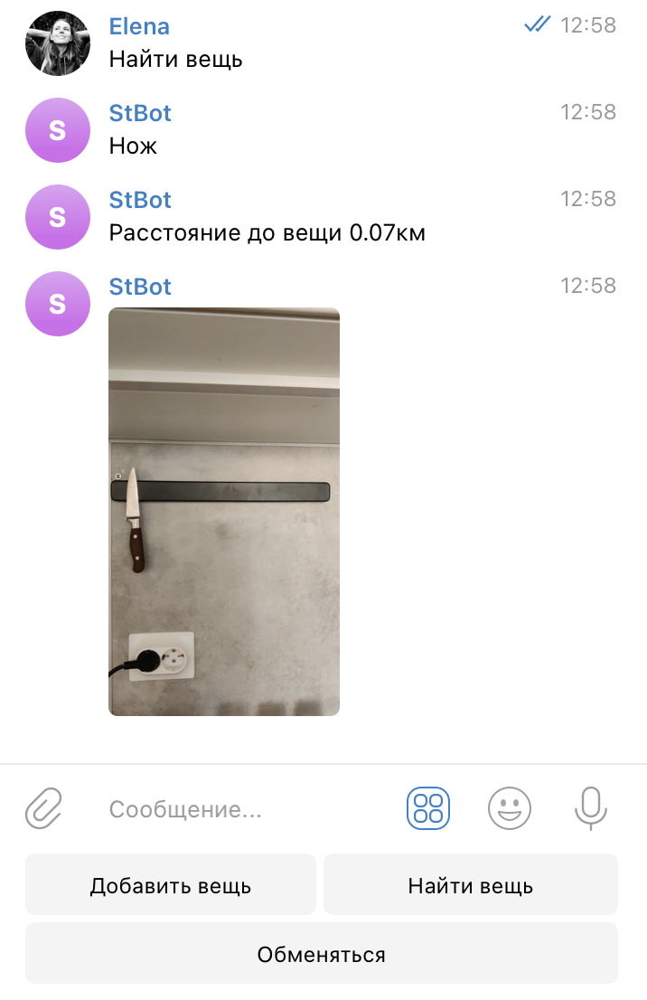
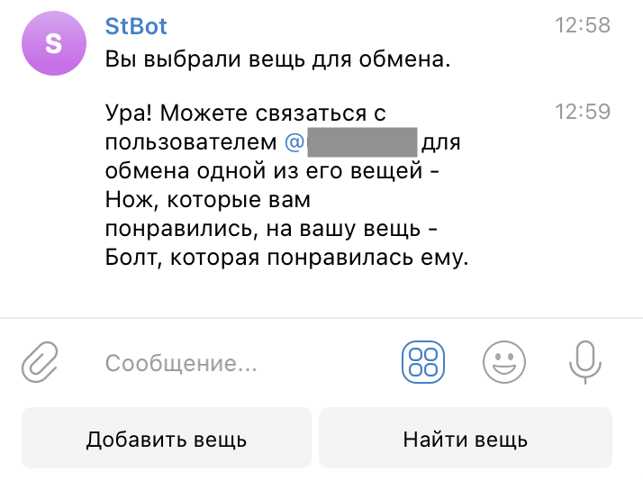

# Чат-бот по обмену вещами

Бесплатный сервис по обмену вещами. Вы можете загружать свои вещи в бота, смотреть вещи других пользователей и лайкать понравившиеся.</br>
В случае если пользователю также понравится ваша вещь, вы оба получите сообщение с предложением обменяться и контактами.</br>
В первую очередь пользователь видит вещи тех пользователей, которые лайкали его вещи.</br>

Пример: `@Stuff_Exchange_Bot`

### Пример использования

</br>
</br>


### Как установить

Создайте файл `.env` и поместите туда ваш телеграмм токен
```
BOT_TOKEN=
```

Python3 должен быть уже установлен. 
Затем используйте `pip` (или `pip3`, если есть конфликт с Python2) для установки зависимостей:
```
pip install -r requirements.txt
```

Чтобы запустить бота, необходимо выполнить команду:
```
python3 bot.py
```

### Цель проекта

Код написан в образовательных целях на онлайн-курсе для веб-разработчиков. [dvmn.org](https://dvmn.org/).
